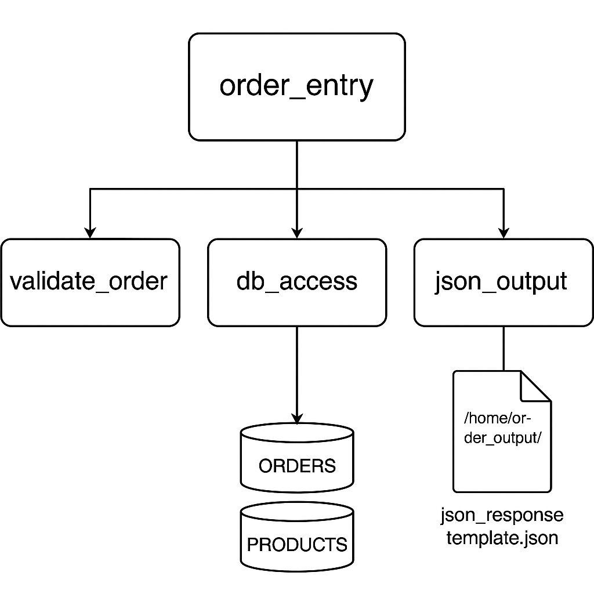

# 🧾 Modern Order Entry System (IBM i RPG Project)

This project is a modular, modernized **order entry system** written in **RPG IV Free Format** for the IBM i (AS/400) platform. It simulates real-world business logic for capturing and processing product orders, using DB2 for data storage and generating JSON order confirmations in the IFS.

---

## 💡 Features

- ✅ **Free-format RPG** modular architecture
- 📦 **DB2-based** storage of product and order information
- 📂 **IFS output** of JSON-formatted order confirmations
- 📄 Simulated **external integration** with a JSON API template
- 🧪 Testable and ready for DevOps workflows (CL compile script included)

---

## 🗂️ Project Structure

```
modern-order-entry/
├── src/                   # RPG source modules
│   ├── order_entry.rpgle
│   ├── validate_order.rpgle
│   ├── db_access.rpgle
│   ├── json_output.rpgle
│   └── compile.clle
├── ddl/                   # DB2 table definitions
│   ├── orders.sql
│   └── products.sql
├── ifs_output/            # JSON output folder
│   └── order_response_template.json
├── mock_api/              # Simulated API data
│   └── sample_product_response.json
├── docs/                  # Documentation and diagrams
│   ├── architecture.png
│   └── compile_instructions.md
└── README.md
```

---

## 🔧 Getting Started

### 1. Create DB2 Tables

Run the SQL files from `/ddl` to create the `ORDERS` and `PRODUCTS` tables:
```sql
RUNSQLSTM SRCFILE(MYLIB/QDDSSRC) SRCMBR(ORDERS)
RUNSQLSTM SRCFILE(MYLIB/QDDSSRC) SRCMBR(PRODUCTS)
```

### 2. Load Source Members

Copy `.rpgle` and `.clle` files to your IBM i source physical files, e.g.:
- `QRPGLESRC` for RPG code
- `QCLSRC` for CL programs

### 3. Compile All Programs

Use the CL script:
```cl
CALL MYLIB/COMPILE
```

### 4. Run the Order Entry Program

Execute the main RPG module:
```cl
CALL MYLIB/ORDER_ENTRY
```

### 5. Check Output in IFS

After running, find the JSON confirmation in:
```
/home/order_output/order_<order_id>.json
```

---

## 📈 Architecture Overview



---

## 🚀 Future Enhancements

- HTTP API integration for real-time product lookup
- Inventory updates and stock validation in `validate_order.rpgle`
- RPG Unit Testing framework integration
- Web-based frontend to display order JSONs

---

## 🧑‍💻 Author

**Timothy Cotterell**  
RPG Developer | Software Engineer | IBM i Enthusiast

---

## 📄 License

This project is open-source and available under the [MIT License](LICENSE).
